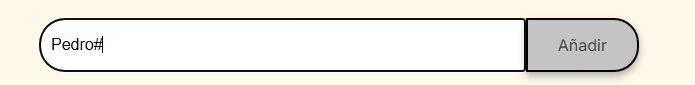
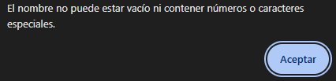
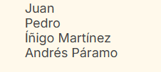
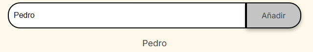
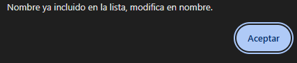
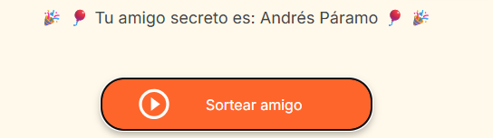

<h1>🎊 Challenge Amigo secreto</h1>

<h3>Descripción:</h3>

 Esta aplicación permite al usuario ingresar nombres de personas para posteriormente realizar un sorteo aleatorio y determinar quién será el amigo secreto.

<h3>Funcionalidades:</h3>

La aplicaión consta de tres partes a saber:

1. Entrada de información:

En este espacio podrás ingresar uno a uno el nombre de las personas que participarán en el sorteo.
    
Ten en cuenta dichos nombre no pueden contener caracteres numéricos, caracteres especiales como #%$! o añadir estando vacío el espacio, en tal cado la aplicación te informará que dicha información ingresada no es válida.

Por ejemplo: Ingresar y añadir 'Pedro#'

Generará la siguiente alerta para que corrijas el nombre a ingresar

2. Visualización de listado de nombre ingresados:

En esta área podrás ver el listado de personas que has ingresado y harán parte del sorteo.

Ten en cuenta que no es posible agregar dos nombres exactamente iguales.

Se generará una alerta indicando que el nombre ya está incluido en la lista, por lo que deberás cambiar el nombre ingresado, se ha dejado la opción de cambiar mayúsculas por minúsculas si deseas hacer tal distinción.

3. Botón de sorteo y visualización de ganador:

Por último tenemos el botón de sorteo que seleccionará uno de los nombres en la lista y te indicará quién es tu amigo secreo.

