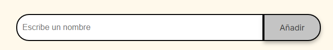

<h1>🎊 Challenge Amigo secreto</h1>

<h3>Descripción:</h3>

  Esta aplicación permite al usuario ingresar nombres de personas para posteriormente realizar un sorteo aleatorio y determinar quién será el amigo secreto.

<h3>Funcionalidades:<h3>

    La aplicaión consta de tres partes a saber:

        1.Entrada de información:

        En este espacio podrás ingresar uno a uno el nombre de las personas que participarán en el sorteo. Ten en cuenta dichos nombre no pueden contener caracteres numéricos, caracteres especiales como #%$! o añadir espacios en blanco, en tal cado la aplicación te informará que dicha información ingresada no es válida.

